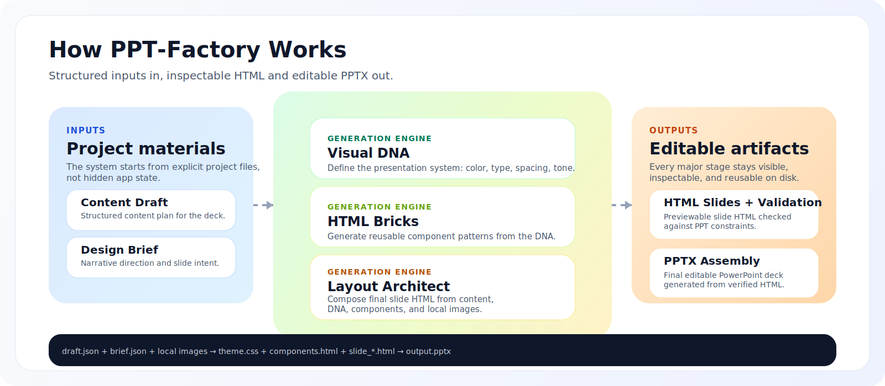

# PPT Design

Turn a structured brief into production-ready HTML slides and a final PPTX, with a local-first workflow that keeps your project files visible on disk.

PPT Design is an open-source slide production system for teams who want more control than prompt-in, deck-out demos. It gives you an explicit project workspace, structured intermediate artifacts, HTML slide generation, validation, and PPTX assembly in one pipeline.

## Workflow At A Glance



## Why This Project Exists

Most AI presentation tools hide the real work inside opaque state:

- prompts disappear
- assets are hard to inspect
- iteration is awkward
- output quality is hard to stabilize

PPT Design takes a different approach.

Instead of treating slide generation as a black box, it treats it as a visible production workflow:

- create a project explicitly
- keep inputs and outputs organized in a local folder
- upload and reuse your own images
- generate structured `Content Draft` and `Design Brief`
- produce HTML slides before PPTX assembly
- validate slides before export

The result is a workflow that is easier to debug, easier to iterate on, and much easier to adapt for real product or research use.

## What The Open-Source Version Includes

- Local-first project workspace
- Explicit project creation before downstream generation
- `Content Draft` generation
- `Design Brief` generation
- HTML slide layout generation
- HTML preview and validation
- PPTX assembly
- Local image upload, storage, and binding

## What It Intentionally Does Not Include

This public repository is the open-source track only.

It does not ship:

- AI image generation
- stock-photo retrieval
- private image orchestration prompts
- internal-only image generation scripts

If a feature depends on generated imagery or private prompt chains for image creation, it belongs to the internal track rather than this repository.

The version split is documented in [docs/versioning.md](docs/versioning.md).

## Core Workflow

The current public app is designed around a clear, inspectable sequence:

1. Create a project
2. Choose a local project folder
3. Upload local images into the project
4. Generate `Content Draft`
5. Generate `Design Brief`
6. Generate HTML layouts
7. Run HTML validation
8. Assemble the final PPTX

This makes the pipeline much easier to reason about than a single “generate everything” button.

## Local Project Structure

Projects are saved into a local workspace so you can inspect what the system generated at every stage.

Typical structure:

```text
<project-root>/
  <project-id>/
    input/
      brief.json
      draft.json
      images/
    work/
      1_html_slides/
      3_pptx/
```

That means your draft, brief, uploaded images, generated HTML, and PPT output are all easy to inspect and reuse.

## Why The Local-First Model Matters

PPT Design is especially useful when you care about:

- traceable intermediate artifacts
- repeatable slide generation
- plugging your own prompts and schemas into the workflow
- working with local assets instead of remote black-box storage
- improving HTML-to-PPT reliability over time

It is a good fit for productized deck generation, internal tooling, research presentation workflows, and experimentation with structured slide pipelines.

## Local Images, Not Generated Images

The public version supports user-provided local images only.

- Upload images into the project
- Store them under the project workspace
- Let layout use file semantics and image metadata
- Bind the real files into generated slides

This keeps the open-source version simpler, more reproducible, and easier to maintain.

## Requirements

- Node.js 20+
- Python 3.9+
- macOS recommended for the current folder-picker flow

Notes:

- The frontend runs in local-storage mode by default
- Supabase is optional, not required
- LLM-backed draft and brief generation requires the relevant API key in the frontend environment

## Quick Start

Fastest setup:

```bash
make setup
make dev
```

Or, if you prefer running the bootstrap script directly:

```bash
bash scripts/bootstrap_open_source.sh
cd frontend
npm run dev
```

Then open [http://localhost:3000](http://localhost:3000).

## Dependency Setup

The open-source version is now grouped into three simple entry points:

- [requirements-open-source.txt](requirements-open-source.txt): combined Python dependencies for the public workflow
- [scripts/bootstrap_open_source.sh](scripts/bootstrap_open_source.sh): one-command environment setup
- [Makefile](Makefile): shortcuts for setup and local development

Useful commands:

```bash
make setup
make setup-python
make setup-frontend
make setup-assembly
make dev
```

## Environment

Optional frontend environment settings live in [frontend/.env.local.example](frontend/.env.local.example).

Common optional variables:

- `ANTHROPIC_API_KEY`
- `NEXT_PUBLIC_SUPABASE_URL`
- `NEXT_PUBLIC_SUPABASE_ANON_KEY`
- `USE_SUPABASE_STORAGE=true`

If `USE_SUPABASE_STORAGE` is not set to `true`, the app runs in local mode and requires a writable project folder before generation begins.

## Repository Guide

- [frontend](frontend): Next.js app and project workflow UI
- [my_skills/draft_content](my_skills/draft_content): draft prompts, schema, and generation scripts
- [my_skills/architect_html_layouts](my_skills/architect_html_layouts): HTML layout prompts and slide builder
- [my_skills/assemble_pptx_file](my_skills/assemble_pptx_file): HTML-to-PPTX conversion and assembly
- [docs/versioning.md](docs/versioning.md): open-source vs internal split

## Current Product Shape

The current public app behaves more like a local production tool than a hosted SaaS:

- projects are explicit
- generated inputs are saved into the project folder immediately
- previews focus on individual slides rather than `index.html`
- PPT assembly matches generated HTML files by slide number

That is intentional. The goal is a workflow that stays understandable as the system grows.

## Contributing

Contributions are welcome, especially around:

- workflow polish
- prompt and schema stability
- HTML slide quality
- preview and validation tooling
- HTML-to-PPT conversion reliability

Please keep public contributions aligned with the open-source track. Features that depend on private prompts, internal assets, AI image generation, or stock retrieval should stay out of the public repository.
